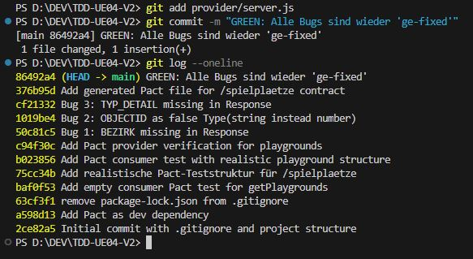

# ✅ Consumer Driven Contract Testing – TDD-UE04-V2

Dies ist die Lösung zur Übung **UE04 – Consumer Driven Contract Testing (CDCT)**  
im Fach **Test Driven Development (TDD)** an der **FH Technikum Wien**, SS 2025.

---

## 🌐 Projektbasis – GreenScape Navi (ITP Projekt)

Als Grundlage wurde ein Teil des bestehenden **GreenScape Projekts** verwendet, das öffentliche Grünflächen in Wien visualisiert.

Für diesen Test wurde ein **künstlicher Consumer & Provider** entwickelt, die mit JSON-Daten der Stadt Wien arbeiten (offenes GeoJSON unter [data.wien.gv.at](https://www.data.gv.at)).

Verwendet wird das Framework [Pact (pact.io)](https://pact.io/) für **Consumer**- und **Provider-Tests**.

---

## 📁 Projektstruktur

```
TDD-UE04-V2/
├── ...
├── consumer/
│   ├── getPlaygrounds.pact.test.js     // Consumer Test
│   └── pact/pacts/                     // Generierte Pact-Files (.json)
│
├── provider/
│   ├── validatePlaygrounds.pact.test.js // Provider Verification
│   └── server.js                         // Dummy-Provider (Express)
│
├── .git/                // Git-Verzeichnis mit Red-Green Commits
├── README.md            // Diese Datei
└── package.json         // Installierte Abhängigkeiten
```

---

## ⚙️ Voraussetzungen

- **Node.js** Version: `v20.14.0`
- **Pact Versionen:**
  - `@pact-foundation/pact`: `15.0.1`
  - `@pact-foundation/pact-node`: `10.14.0`
  - `pact-core`: `16.0.0`

> Die Versionen sind bereits in der `package-lock.json` festgelegt.  
> Bei Ausführung mit `npm ci` werden exakt diese installiert.

---

## 🧪 Test-Anleitung

### 1. Installiere Abhängigkeiten

```bash
npm ci
```

### 2. Führe Consumer-Test aus

```bash
node consumer/getPlaygrounds.pact.test.js
```

Dieser Test generiert eine Datei:

```
consumer/pact/pacts/PlaygroundConsumer-PlaygroundProvider.json
```

### 3. Starte den Provider (Mockserver)

```bash
node provider/server.js
```

> Achtung: Der Port 1235 darf nicht belegt sein.

### 4. Führe Provider-Verifikation aus (in neuem Terminal)

```bash
node provider/validatePlaygrounds.pact.test.js
```

Erwartete Ausgabe: `Verification successful`

---

## 🐞 Bekannter Bug: Pact-Logfiles werden nicht erstellt

> Aufgrund eines Bugs in der aktuellen Version von Pact werden **keine Log-Dateien (.log / .json)** automatisch erstellt.

Dies betrifft:
- `pact.log`
- `mockserver-integration.json`

**Konsequenz:**  
Es ist **kein Fehler deinerseits** und muss daher **nicht im ZIP enthalten sein**.  
Als Nachweis gilt die erfolgreiche Konsolen-Ausgabe + Screenshot.

---

## ✅ Testlauf erfolgreich

Nach der Implementierung des Providers und dem Einbau der 3 Bugs konnte die Konsumenten- und Providerverifikation erfolgreich durchgeführt werden.



Die Response-Struktur entspricht der realistischen GeoJSON-Datenstruktur der Stadt Wien.


## 💡 Hinweise für Vortragenden / Tester

- Zum Testen bitte wie oben beschrieben vorgehen.
- Keine globalen Pakete notwendig, `npm ci` reicht.
- Pact-Files werden lokal erzeugt, keine Internetverbindung nötig.
- Screenshots der erfolgreichen Tests sind im ZIP enthalten.
- Git-Commits folgen dem Red-Green-Schema (2 Commits pro Testfall).

---

## ✍️ Autor

- **Neda [if24b210]**
- Studiengang: Informatik, SS 2025
- FH Technikum Wien